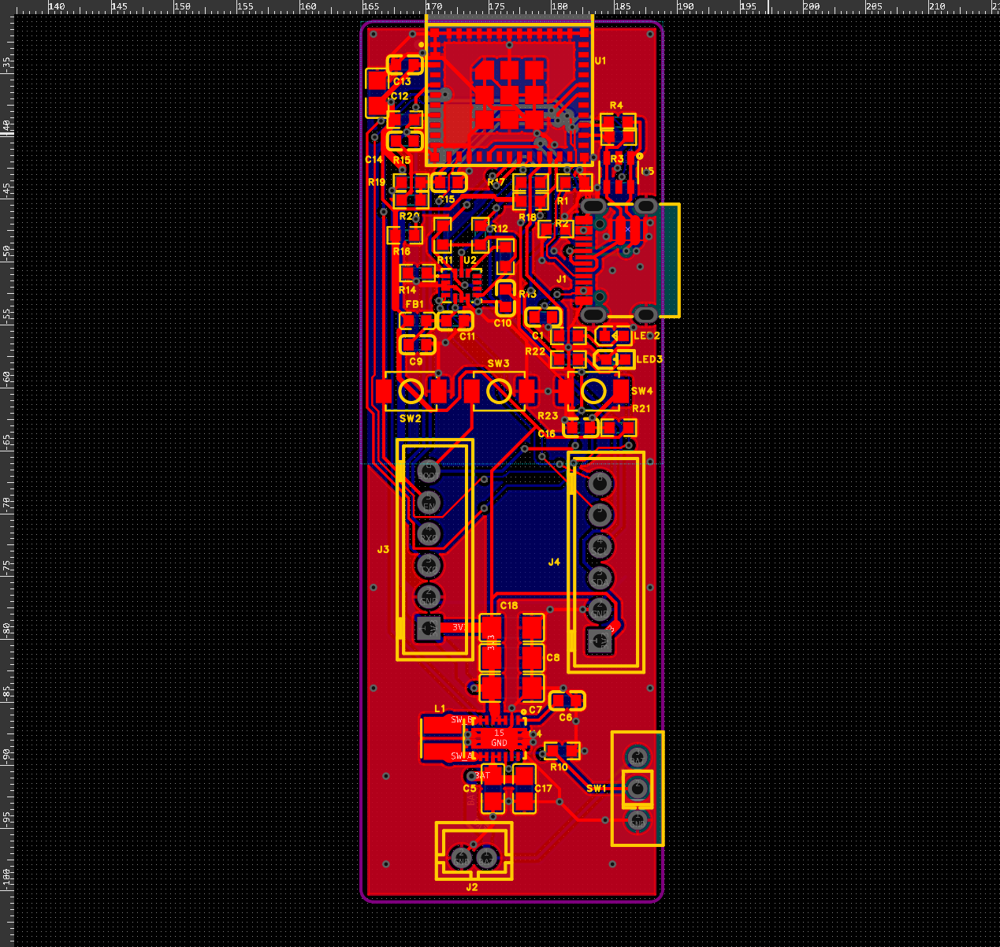

# 裸板硬件与制造资料

主要器件为 ESP32-C3-MINI-1-H4、LSM6DS3TR-C 和 TPS63021。历史制造导出板框为 **24 × 70 mm，圆角 R1 mm**；两层、1.6 mm、外层 1 oz、OSP、全部元件在顶面。后续外壳讨论曾使用 24 × 76 mm 的口述尺寸，不能据此修改或解释本 Gerber 的实际板框。

## 资料来源

- `gerber-2026-09-07.zip`：找到的 2026-09-07 制造导出，包含铜层、阻焊、钢网、丝印、板框与钻孔文件。已按板框坐标核对 24 × 70 mm、R1。未取得工厂订单回执，不能独立断言它与实际投单包逐字节相同。
- `pcb.epcb`、`schematic.esch`、`netlist.json`：2026-09-11 工程检查快照。前两项是编辑文档数据，不是打包全部器件库的完整 `.epro2` 工程；导入方式取决于嘉立创 EDA 版本。不要把它们冒充完整项目归档。
- `BOM.csv`：由上述网表生成的 49 项逐器件清单。采购前核对料号、封装和实物版本，不含已删除的充电电路。

Gerber 与编辑快照日期不同，重新制造时应检查版本对应关系。USB 计算器曾得到约 92.4Ω 的局部截面结果，它不是整条 USB 实测阻抗或整板性能保证。

## 接口与 GPIO

| 功能 | 定义 |
|---|---|
| J2 | 单节电池 BAT / GND，按实际丝印与网络确认极性 |
| J3-1 / 2 | 3V3 / GND |
| J3-3 / 4 | 主控 TX GPIO21 / RX GPIO20 |
| J3-5 / 6 | EN / BOOT GPIO9 |
| J4-1 / 2 | 3V3 / GND |
| J4-3 / 4 | SDA GPIO4 / SCL GPIO5 |
| J4-5 / 6 | GPIO6 / IMU_INT GPIO1 |
| 绿 LED / 红 LED | GPIO7 / GPIO10，高有效 |
| SW4 | GPIO3，低有效 |
| RESET / BOOT | EN / GPIO9 |
| USB D− / D+ | GPIO18 / GPIO19 |

GPIO2、GPIO8 有启动上拉。R15 为 EN 上拉，R16 为 GPIO2、R17 为 GPIO8、R18 为 BOOT/GPIO9 上拉；实装按焊盘网络，不能凭相邻器件方向猜测。

## 电源与使用限制

J1 Type-C 的 5V 不给本板主电源供电，需要 J2 电池输入。没有板载充电电路，也没有额外电池反接保护。USB 连接电脑时不要再用 FT232 VCC 强行给 3V3 供电。

IMU 中断线路功能未完全证实，本版禁用 IMU 中断、采用轮询，不做深度睡眠。用户已接受这一方案，不需要为了使用当前软件先拆焊 IMU。

焊接历史出现过 ESP32 底部锡桥，造成 EN 对地短路以及启动脚互短；返修后功能恢复。这说明焊接与实物检查仍然重要，不能用 DRC 通过代替通电测试。
